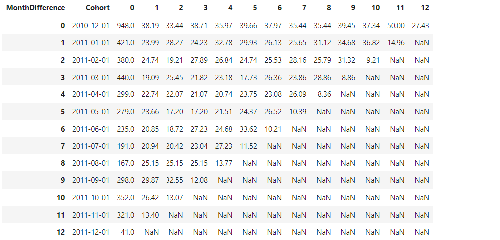
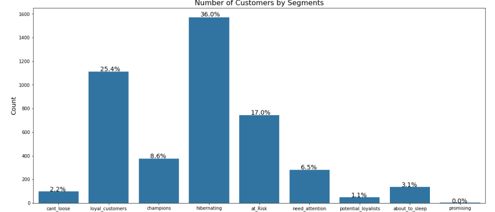
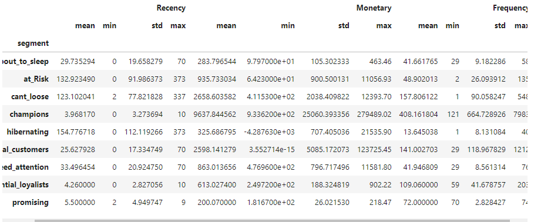

# ECom--Retention-and-Segmentation

## Dataset
- Dataset: [Ecommerce Data](https://www.kaggle.com/datasets/carrie1/ecommerce-data/code?datasetId=1985&sortBy=voteCount)
- Description: Transaction data for an ecommerce online store selling gift items from 2010 to 2011.

## EDA

## Feature Engineering
- **RFM Features**: Recency, Tenure, Frequency, Monetary
- **Product Diversity**: Number of Products Purchased
- **Behavioral Features**: Average Days Between Purchases, Favorite Day for Shopping
- **Geographical Features**: Is from UK or not
- **Cancellation Features**: Cancelled Flag, Number of cancelled orders

## Retention

## Customer Segmentation - Heuristic and Kmeans
Customers are segmented into different clusters based on:
- Recency: How recently they did the transaction
- Frequency: How often the customers are doing transactions
- Monetary: Average Order Value per customer basket

